# BruceOS New Features


BruceOS is a small operating system built on FreeRTOS. It brings a shared hardware SDK and gnu/linux-like tools to small embedded devices. These features also work on supported devices without PSRAM.

## Additional swap partition for devices without PSRAM


BruceOS supports swap memory. Devices without PSRAM can use it as additional memory for some operations.

The swap partition cannot be accessed like regular RAM. Apps can write to it with functions such as `memory__external_write`. This is why BruceOS provides separate APIs for regular allocations (`memory__malloc`) and external-memory allocations (`memory__external_malloc`).

For example, BruceOS can:

- Store ELF binaries in swap instead of keeping them in RAM.
- Decode JPEG and PNG images into swap-backed bitmaps.
- Keep those bitmaps available for later use with the `display__draw_bitmap` functions.

This also allows the ELF loader to run demanding apps, including NES emulators and 3D games, on devices without PSRAM.

The NES emulator requires about 220 KB of memory. By allocating 118 KB in swap, it can run on devices with only about 100 KB of free RAM.


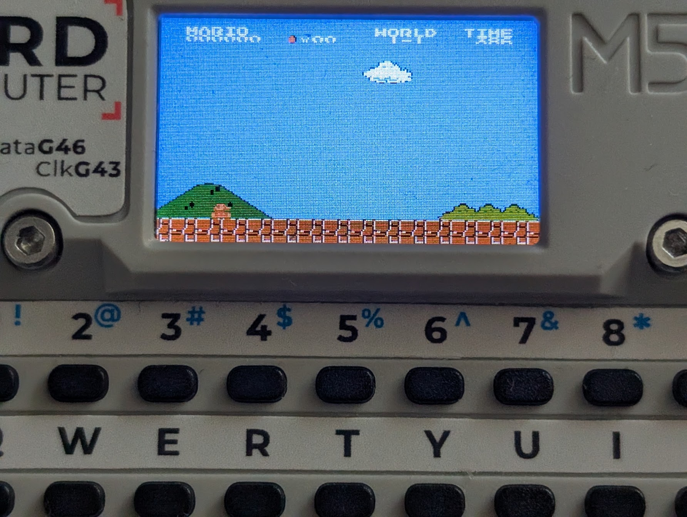

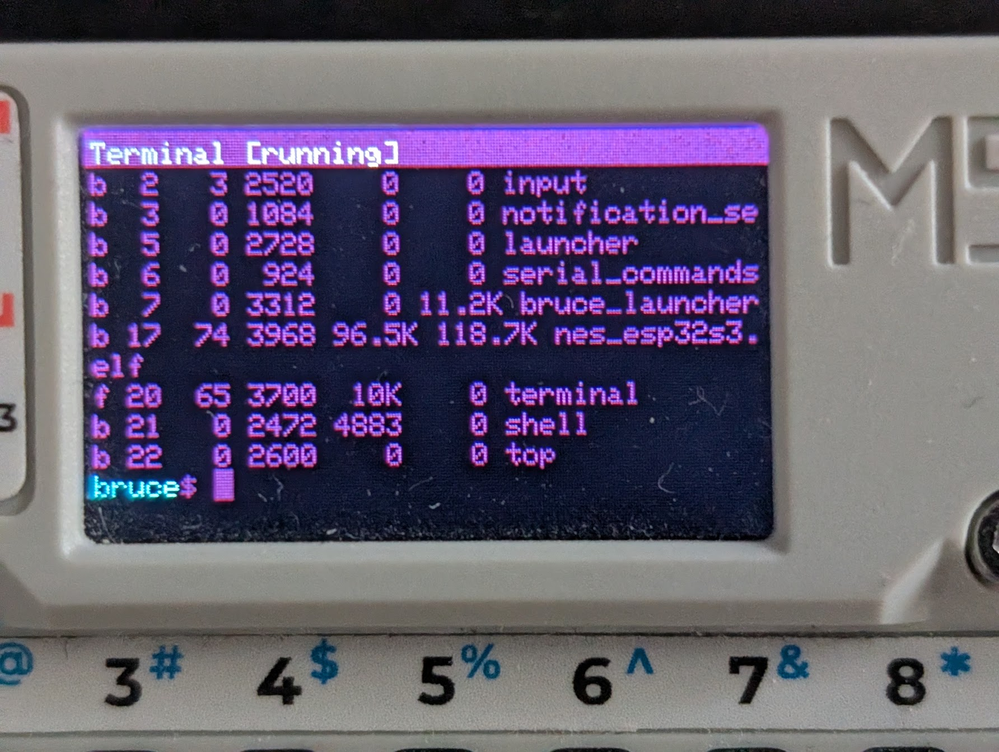

## Partition manager

BruceOS can manage multiple partitions on the same device. The `bparted` command can create, delete, and resize them. You can also add a swap partition if you flashed BruceOS without one.

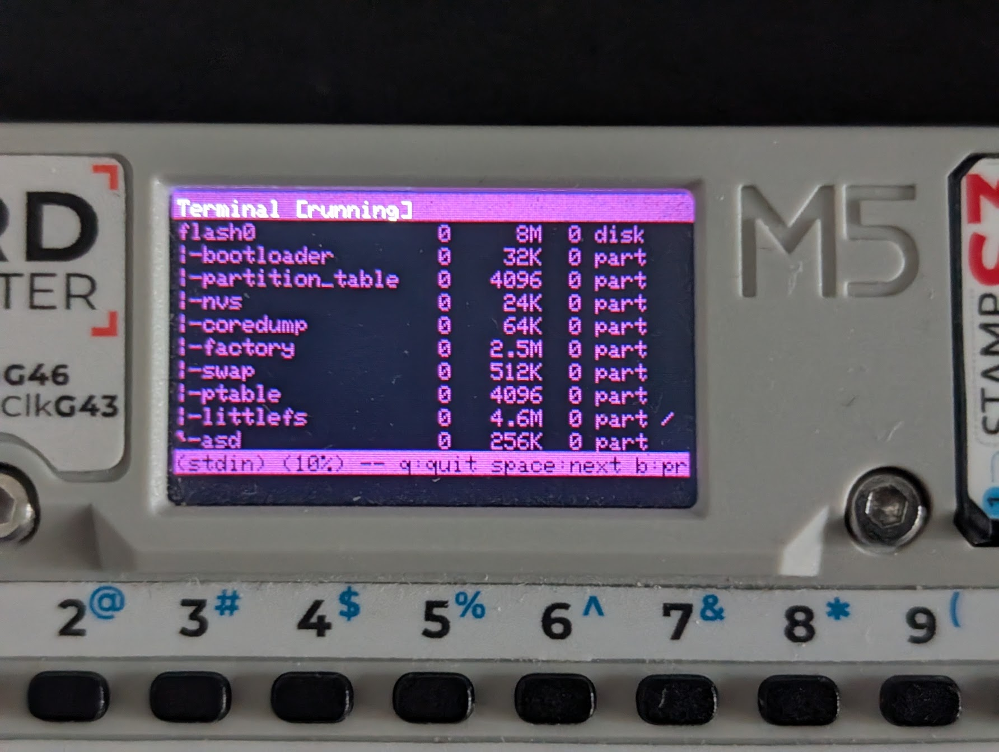

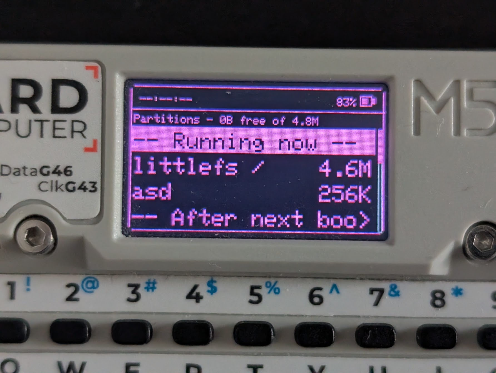

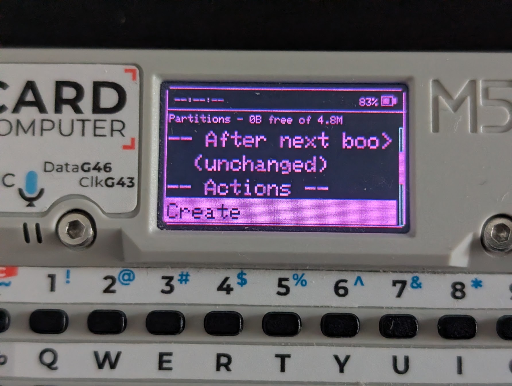

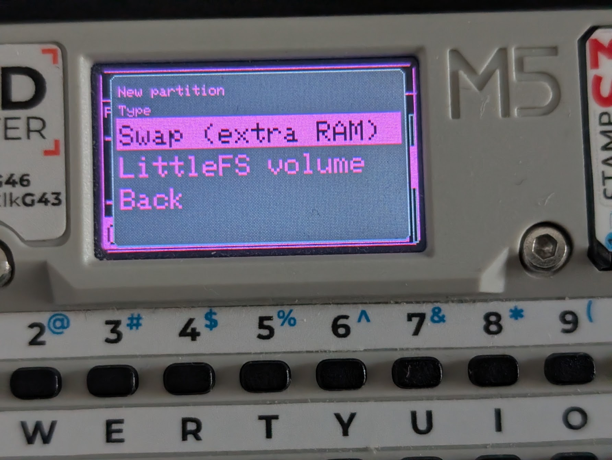

## One process for every app

Every app runs as an independent process, whether it is a built-in module, ELF binary, WebAssembly binary, JavaScript script, or Bash script. When a process exits, BruceOS releases all the RAM allocated by that process.

System apps follow the same model. The boot animation, launcher, and other built-in features are processes too. They can be launched from the terminal or through serial input just like any other app. For example:

```sh
GUI=1 bootanimation
```

Apps can be moved to the background, and users can switch between them with `process switch`. The `process preview` command shows previews of running apps, so several apps can be visible on the screen at once. Those commands are apps too and can be bound to hotkeys for quick access. For example, `ctrl + tab` can show previews of running apps, and `alt + tab` can switch between them. Or access them from the system menu app.

In startup in bruce.conf, you can set which apps run automatically when the system boots. These apps like `launcher` and `serial_commands` can launch other apps and those apps can launch more apps.

No app is special: all apps are equal and can be launched from the terminal, serial interface, or launcher.

```json
"startup": [
  "device_bus",
  "input",
  "notification_service",
  "BG=0 bootanimation",
  "launcher -s",
  "serial_commands"
]
```


## New configuration files

BruceOS stores its main system settings in `bruce.conf`:

```json
{
  "theme": {
    "primary": "a80f",
    "secondary": "880f",
    "background": "0",
    "surface": "1082",
    "text": "ffff",
    "textMuted": "8410",
    "border": "4208",
    "success": "7760",
    "warning": "fd20",
    "error": "f800"
  },
  "display": {
    "rotation": 0,
    "dimTimeout": 60,
    "brightness": 100,
    "bufferedRendering": true,
    "dmaFramebuffer": true
  },
  "time": {
    "automaticUpdateViaNTP": true,
    "timezone": 0,
    "dst": false,
    "clock24hr": true
  },
  "sound": {
    "enabled": true,
    "volume": 100
  },
  "keyboardLang": "QWERTY",
  "hotkeys": {
    "alt + tab": "process switch next",
    "ctrl + tab": "process preview",
    "ctrl + space": "launcher",
    "500ms BTN_A": "GUI=1 OVERLAY=1 menu",
    "BTN_A": "emit PREV",
    "BTN_B": "emit SELECT",
    "BTN_C": "emit NEXT"
  },
  "led": {
    ...
  },
  "wifi": {
    ...
  },
  "startup": [
    "device_bus",
    "input",
    "notification_service",
    "BG=0 bootanimation",
    "launcher -s",
    "serial_commands"
  ],
  "devMode": 0,
  "launcher": ""
}
```

The launcher menu is defined in `launcher.conf`:

```json
{
  "WiFi@wifi": {
    "$WIFI_CONNECT_TEXT": "BG=1 wifi toggle",
    "$WIFI_AP_CONNECT_TEXT": "BG=1 wifi ap toggle",
    "Scan": "wifi scan",
    "AP info": "terminal wifi ap info",
    "WebUI": "webui",
    "Wifi Atks": {
      "Target Atks": "wifiatks target",
      "Karma Attack": "wifiatks karma",
      "Beacon SPAM": "wifiatks beacon"
    }
  },
  "Bluetooth@bluetooth": {
    "BLE scan": "bluetooth scan"
  },
  "Infrared@infrared": {
    "TV-B-Gone": "ir tvbgone",
    "IR jammer": "ir jam",
    "Learn signal": "ir learn_custom",
    "Quick remote setup": "ir quick_learn",
    "Transmit .ir file": "ir tx_pick_file",
    "Read/view signal": "ir rx"
  },
  "NRF24@radio-handheld": {
    "Spectrum scan": "nrf24 scan",
    "Radio status": "nrf24 status",
    "Information": "nrf24 info"
  },
  "Files@folder-open": "filemanager",
  "Browser@web": "browser",
  "Terminal@console": "terminal",
  "Clock@clock-outline": "clock",
  "Config@cog": {
    "Display & UI": "config display",
    "Launcher": "launcher config",
    "LED Config": "config led",
    "Audio Config": "config audio",
    "System Config": {
      "Startup Apps": "config system startup",
      "Clock": "config system clock",
      "Advanced": {
        "Factory reset": "config system reset_defaults confirm"
      }
    },
    "Power": "config power",
    "Install App Store": "appstore install",
    "App Permissions": "permissions",
    "Partitions": "bparted",
    "About": "config about"
  },
  "Selftest@test-tube": "terminal selftest",
  "Apps@apps": "apps"
}
```

The launcher runs the same apps as the terminal and serial interface, but sets the `GUI=1` environment variable by default (you can override it with `GUI=0`). 

This allows apps to choose between drawing on the display and writing to standard output.

Text after `@`, such as `@wifi`, selects an icon and can be changed. You can also add an app with the `"App name@icon": "command"` format or reorganize existing entries by editing `launcher.conf`.

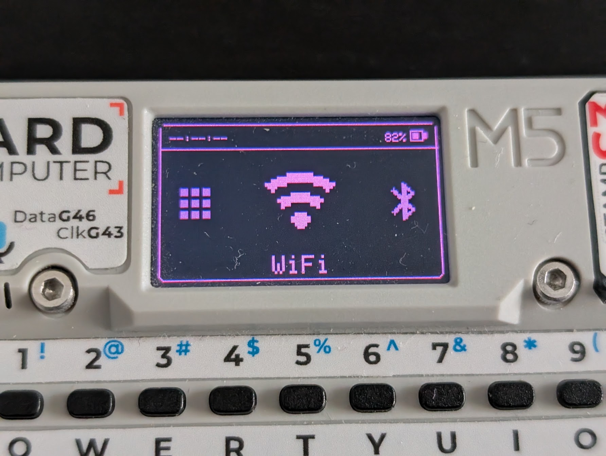

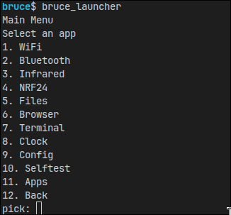

In images above, first one shows the `GUI=1 bruce_launcher`, and the second one shows the same command `bruce_launcher` running on a PC through the serial interface.

## Startup apps

You can configure which apps BruceOS launches at startup. The `startup` array in `bruce.conf` lists the apps that start automatically when the system boots.

```json
"startup": [
  "device_bus",
  "input",
  "notification_service",
  "BG=0 bootanimation",
  "launcher -s",
  "serial_commands"
]
```
If your device does not have a display, or you do not want to use it, remove `BG=0 bootanimation` and `launcher -s` from the startup array. The system will then boot without a graphical interface.

You can add `serial_commands` or `webui start` to control the system remotely. Even `input` is optional: you can replace it or add other input methods, such as an IR remote or Bluetooth gamepad.

The `launcher` and `serial_commands` apps are the main BruceOS interfaces, but you can replace them with your own apps to create a custom interface.

You can even brick your device if you remove everything from the startup.

## One app works in the GUI and terminal

BruceOS does not have separate serial-command and main-menu implementations. Every app can be launched from the built-in terminal, through serial input, or from the main menu (`bruce_launcher`).

The launcher starts apps with the `GUI=1` environment variable. An app can check this variable when it needs to choose between writing directly to the display and writing to standard output.

Apps that use Core functions such as `display__*` and `notification__push` often do not need to check it themselves. BruceOS automatically selects the appropriate GUI or terminal output. This means an application can be written once and used from both interfaces.

For example, the same `wifi toggle` app works from the GUI, terminal, and serial interface:

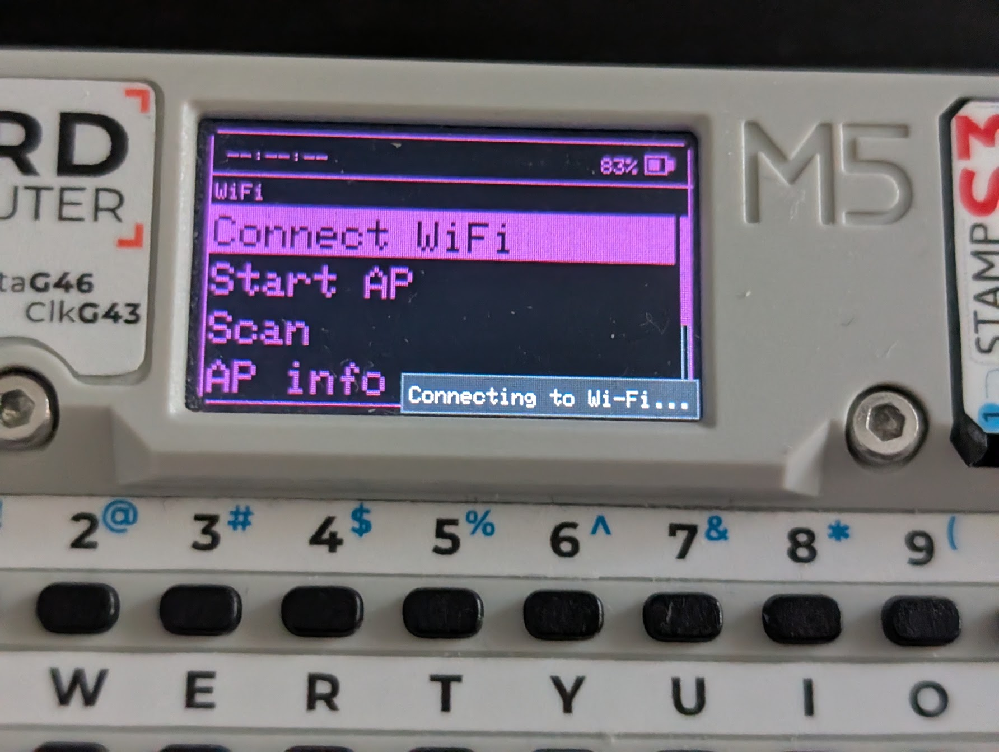

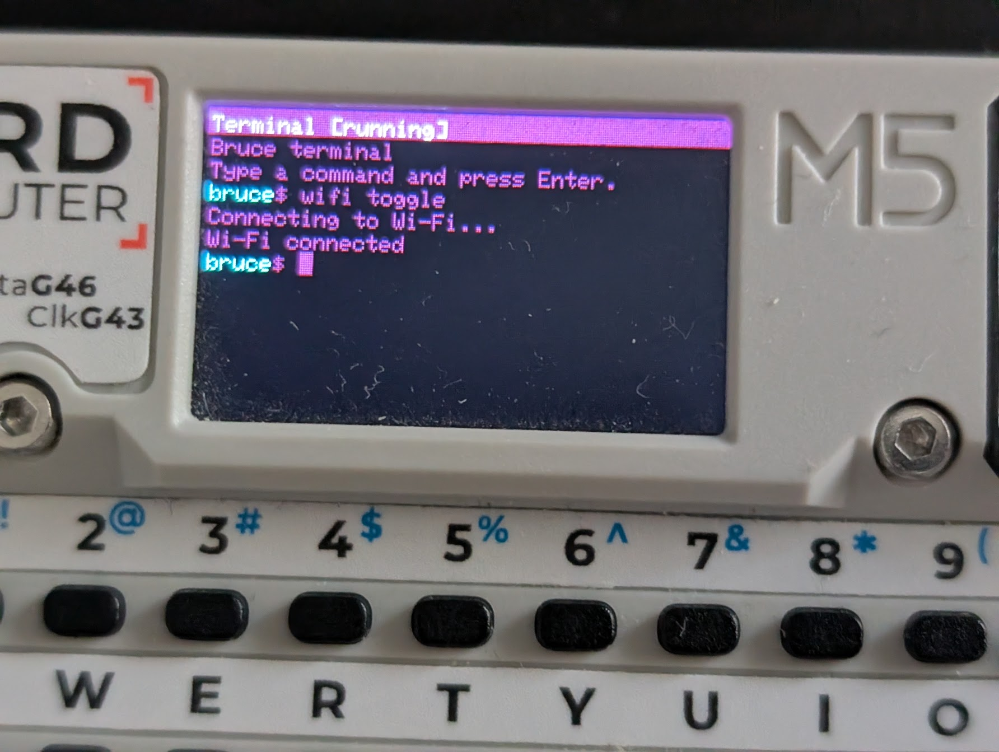

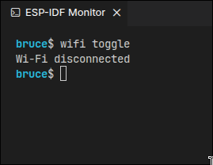

## System menu

The system menu is also a regular app. It provides quick access to common actions, including closing the menu, sending Escape, switching processes, opening the launcher, and powering off the device.

It is for devices without keyboards, you can bind it to a button in the `hotkeys` section of `bruce.conf`. For example, the following line binds it to a long press of the A button:

```json
"500ms BTN_A": "GUI=1 OVERLAY=1 menu"
```

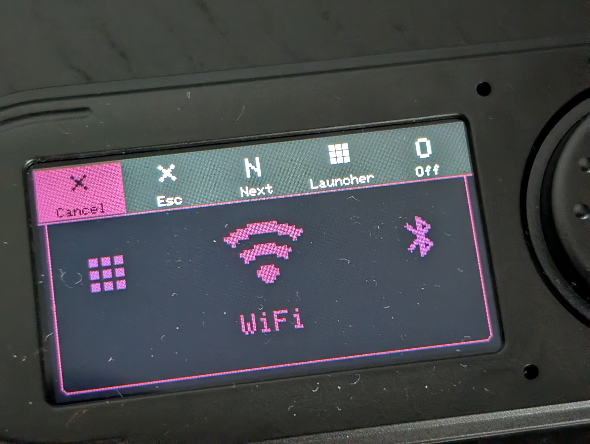

## Built-in terminal and commands

BruceOS includes a full terminal emulator. It accepts the same commands as the serial interface and supports colors and ANSI escape codes.

It also provides familiar GNU/Linux-style commands, including `cd`, `pwd`, `ls`, `head`, `tail`, `less`, `man`, and `ssh`.


The complete command reference is available in [COMMANDS.md](COMMANDS.md). It is generated directly from the BruceOS command implementations with:

```sh
man --gen-md
```

## Apps and the Bruce SDK

Applications use the [BruceOS Core SDK](bruce_sdk.md) to communicate with hardware and system services. The SDK is designed for safe concurrent use, allowing multiple apps to use the same capabilities without each app implementing its own hardware access.

## SSH and interactive CLI programs

The terminal's ANSI support makes SSH sessions behave much like they do on a PC. BruceOS can run interactive remote CLI programs such as `htop`, OpenCode, and Claude.


## UTF-8 support

BruceOS supports UTF-8 text, allowing apps and terminal sessions to display text in many languages.


## HTTPS and HTML rendering

BruceOS can make HTTPS requests even on devices without PSRAM.

Core also includes an HTML parser. The Browser app uses it to parse and render HTML pages, including on devices without PSRAM.

Did I say that every function I mentioned in BruceOS is available on devices without PSRAM? (If you create a swap partition)


## Filemanager

Filemanager is just a filebrowser. It does not display images or text itself. When it opens a file it calls `app_runner__run_path("/path_to_file", "args", BRUCE_LAUNCH_FOREGROUND)`.
And the BruceOS app runner will run the file with the appropriate app configured in `extensions.conf`. 

For example, if you open a `.jpg` file, it will run `image` app. 

If you open a `.txt` file, it will run `text` app. `.elf` files will be run with `elf` app, `.sh` with `shell` in the `terminal`.

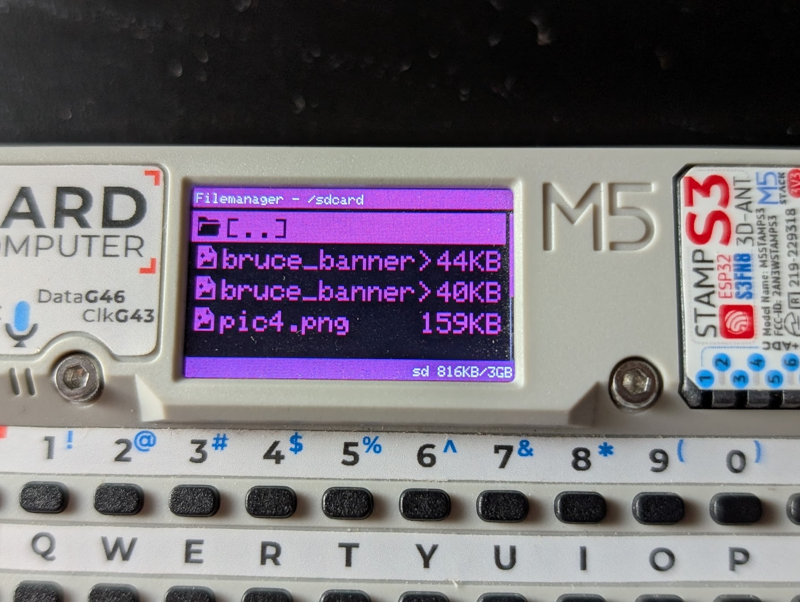

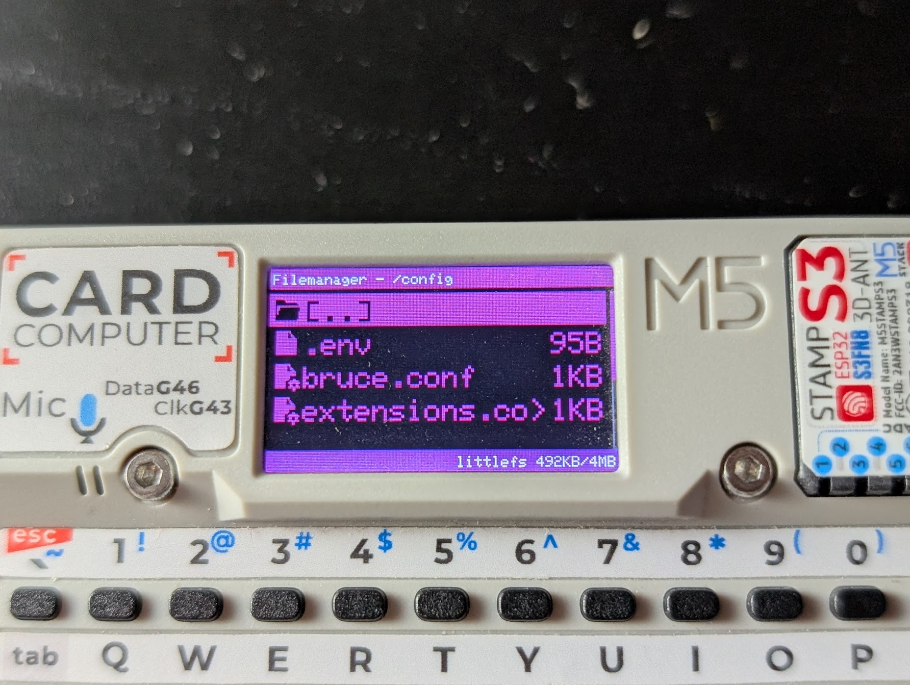
