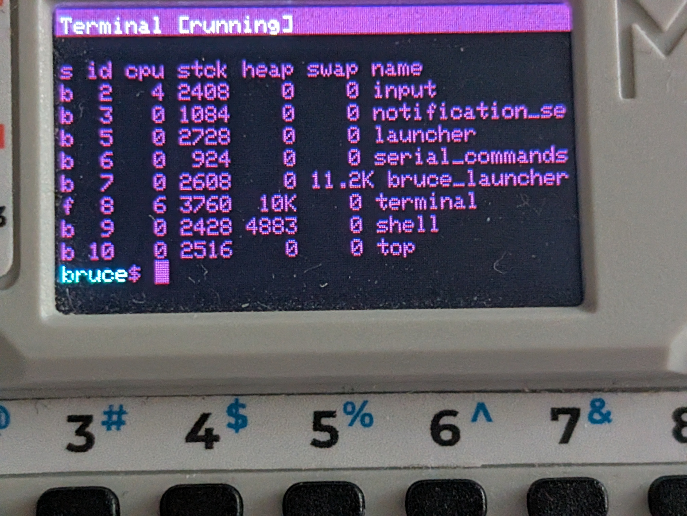
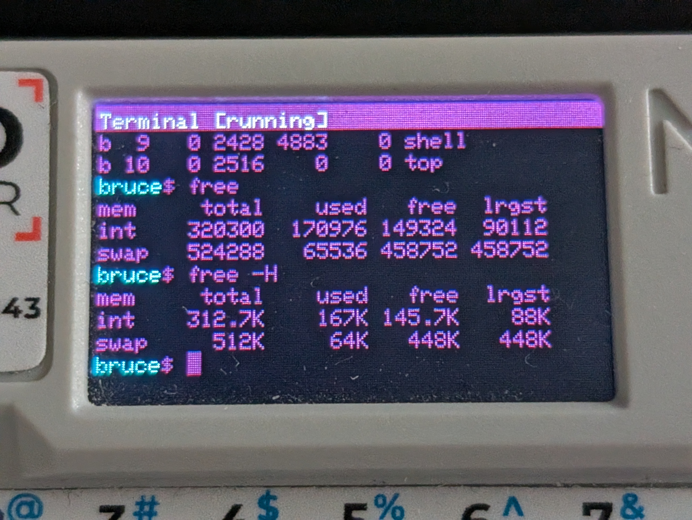
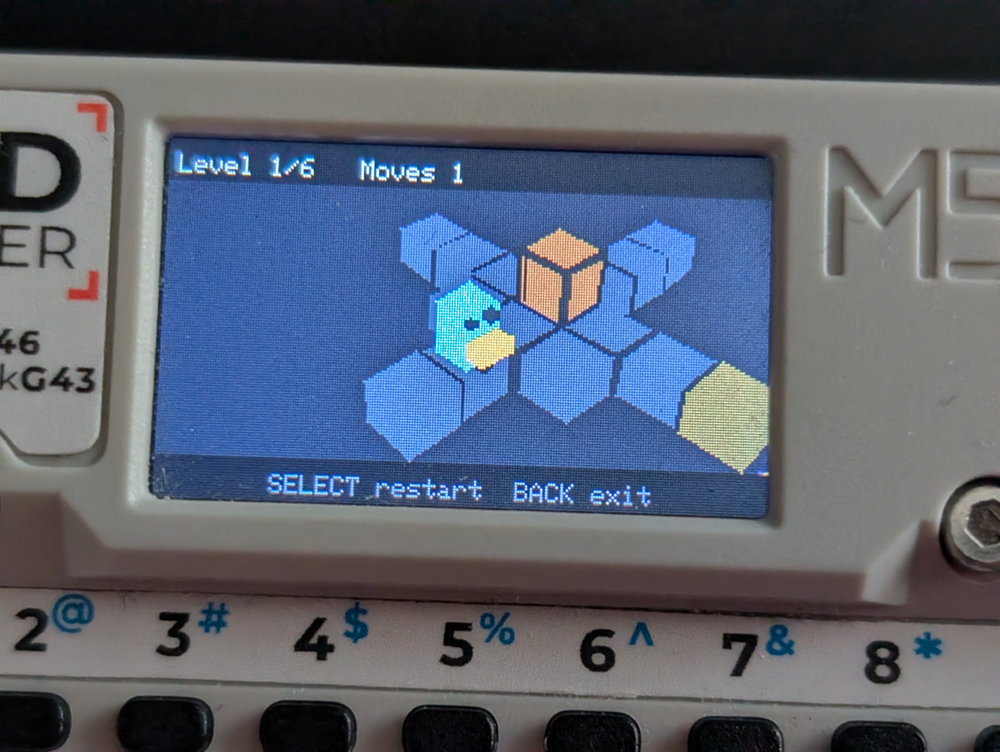
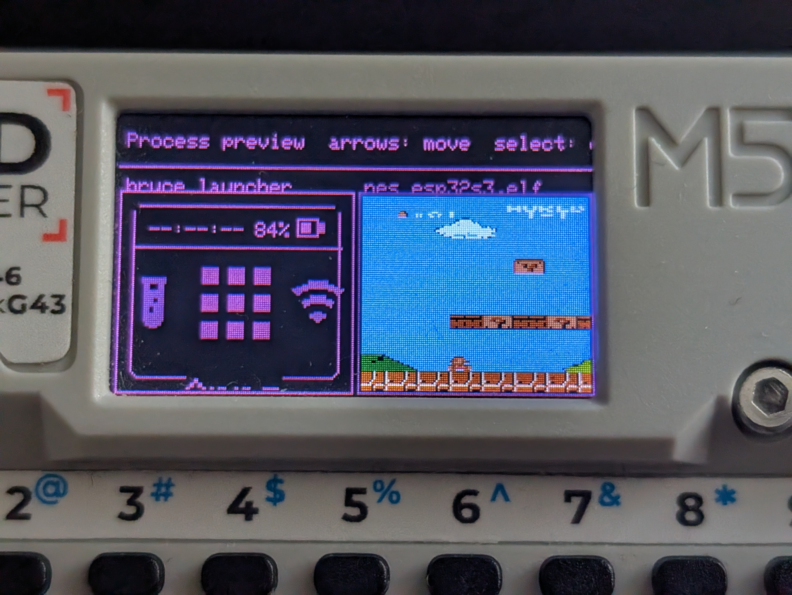
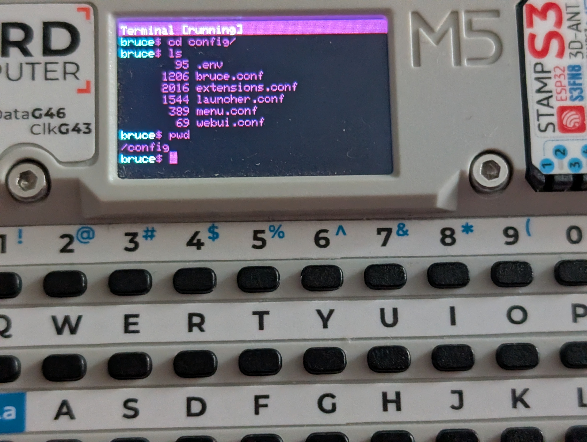
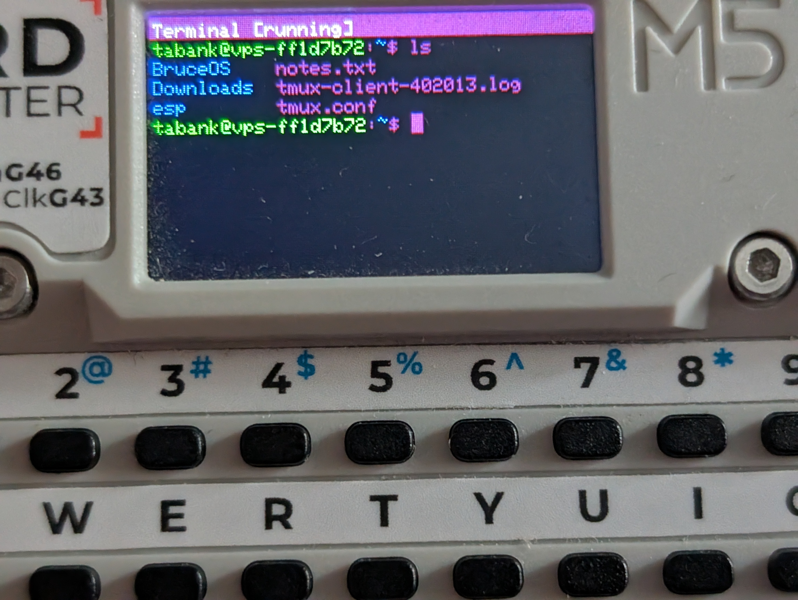
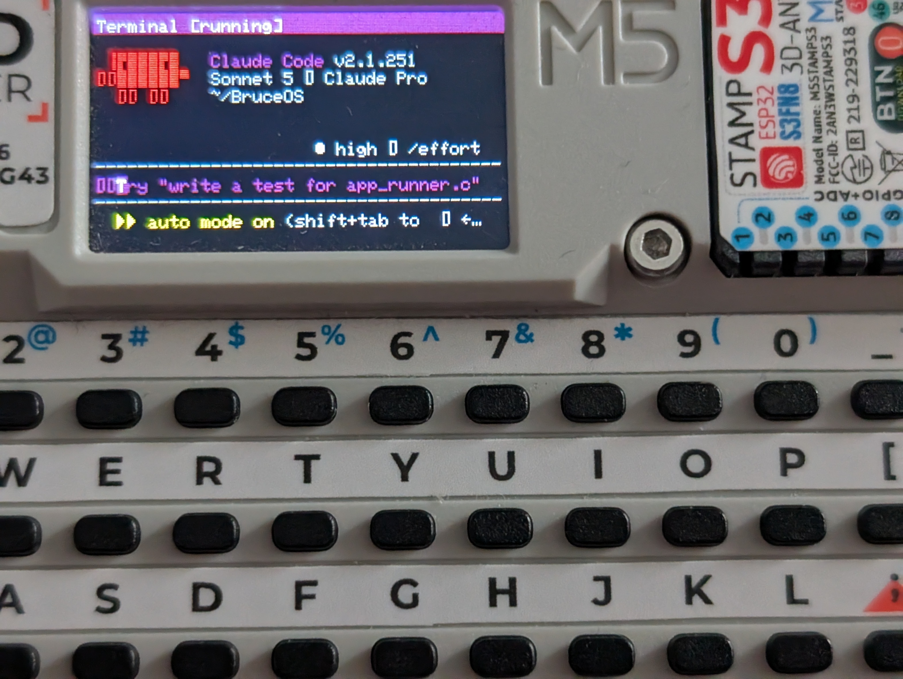
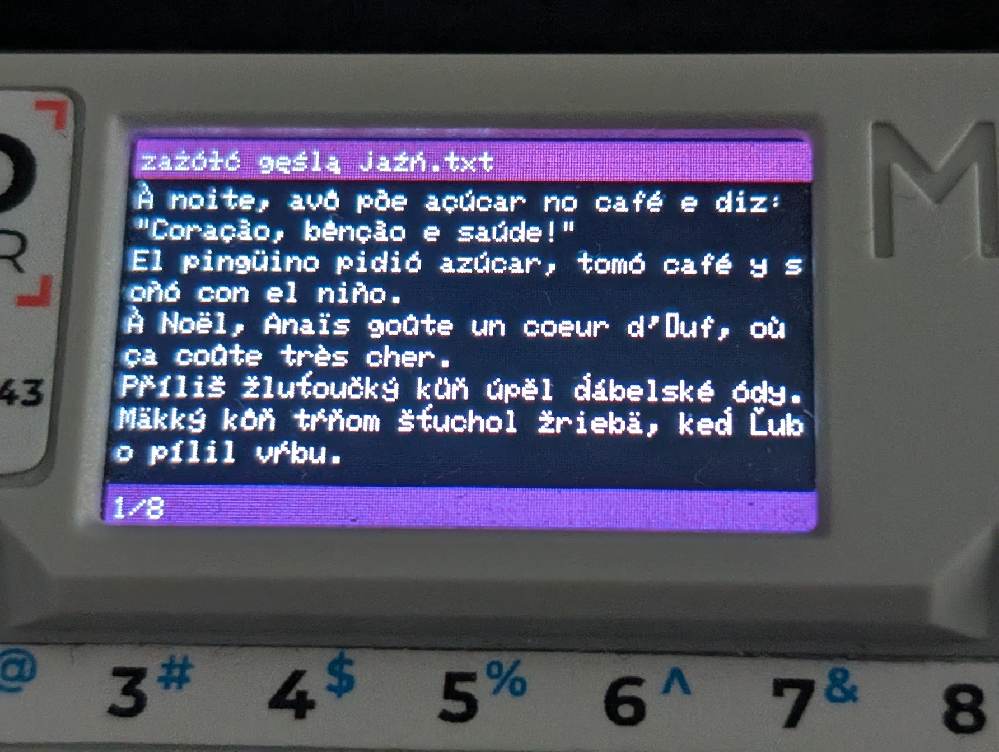
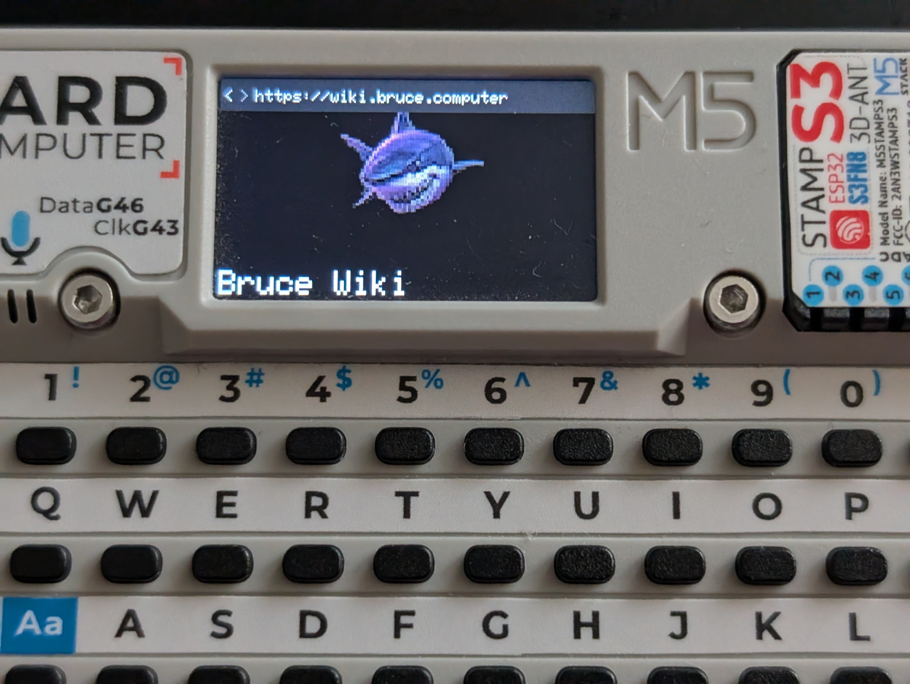
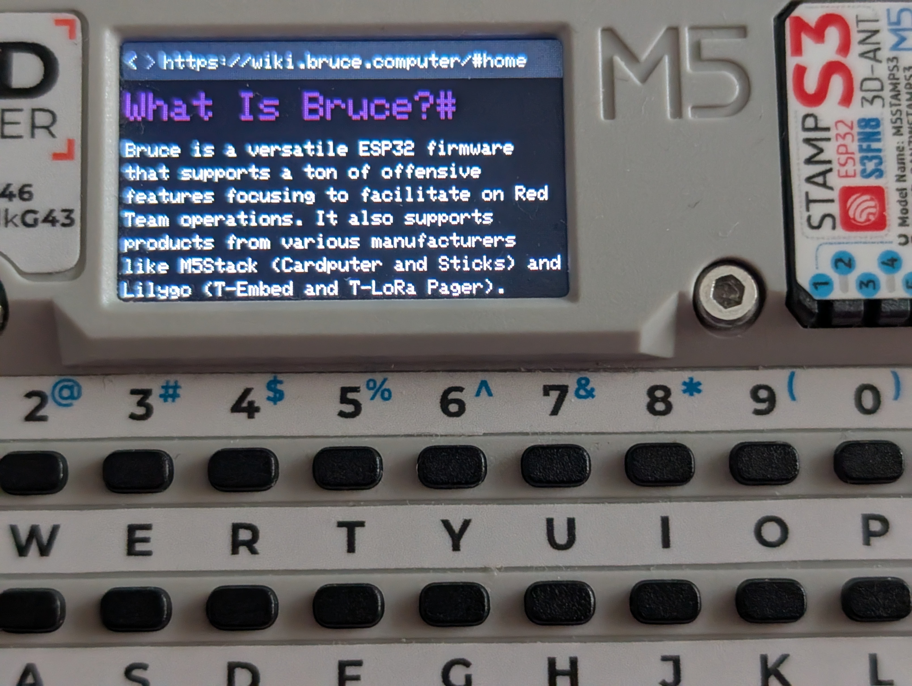

# BruceOS New Features



BruceOS is a small operating system wrapped around FreeRTOS. It provides a shared hardware SDK and desktop-like tools to small embedded devices. These features also work on supported devices without PSRAM.

## Additional swap partition for devices without PSRAM



BruceOS supports swap memory. Devices without PSRAM can use swap as additional memory for some operations.
The swap partition is limited you write to it directly, you need to use `memory__external_write` so thats why there is a separate api for `memory__malloc` and `memory__external_malloc`.

For example, BruceOS can:

- store ELF binaries in swap instead of keeping them in RAM;
- decode JPEG and PNG images into swap-backed bitmaps; and
- keep those bitmaps available for later use with the `display__draw_bitmap` functions.

This also allows the ELF loader to run demanding apps, including NES emulators and 3D games, on devices without PSRAM.



## One process for every app

Every app runs as an independent process, whether it is a built-in module, ELF binary, WebAssembly binary, JavaScript script, or Bash script. When a process exits, BruceOS releases all the RAM allocated by that process.

System apps follow the same model. The boot animation, launcher, and other built-in features are processes too. They can be launched from the terminal or through serial input just like any other app. For example:

```sh
GUI=1 bootanimation
```

Apps can be moved to the background, and users can switch between them. The `process preview` command shows previews of running apps, so several apps can be visible on the screen at once.



## One app works in the GUI and terminal

BruceOS does not have separate serial-command and main-menu implementations. Every app can be launched from the built-in terminal, or through serial input, or from the main menu (`bruce_launcher`).

The launcher starts apps with the `GUI=1` environment variable. An app can check this variable when it needs to choose between writing directly to the display and writing to standard output.

Apps that use Core functions such as `display__*` and `notification__push` not need to check it themselves. BruceOS automatically selects the appropriate GUI or terminal output. This means an Application can be written once and used from both interfaces.

## Built-in terminal and commands

BruceOS includes a full terminal emulator. It accepts the same commands as the serial interface and supports colors and ANSI escape codes.

It also provides familiar GNU/Linux-style commands, including `cd`, `pwd`, `ls`, `head`, `tail`, `less`, `man`, and `ssh`.



The complete command reference is available in [COMMANDS.md](COMMANDS.md). It is generated directly from the BruceOS command implementations with:

```sh
man --gen-md
```

## Apps and the Bruce SDK

Applications use the [BruceOS Core SDK](bruce_sdk.md) to communicate with hardware and system services. The SDK is designed for safe concurrent use, allowing multiple apps to use the same capabilities without each app implementing its own hardware access.

## SSH and interactive CLI programs

The terminal's ANSI support makes SSH sessions behave much like they do on a PC. BruceOS can run interactive remote CLI programs such as `htop`, OpenCode, and Claude.





## UTF-8 support

BruceOS supports UTF-8 text, allowing apps and terminal sessions to display text in many languages.



## HTTPS and HTML rendering

BruceOS can make HTTPS requests even on supported devices without PSRAM.

Core also includes an HTML parser. The Browser app uses it to parse and render HTML pages, including on devices without PSRAM.




